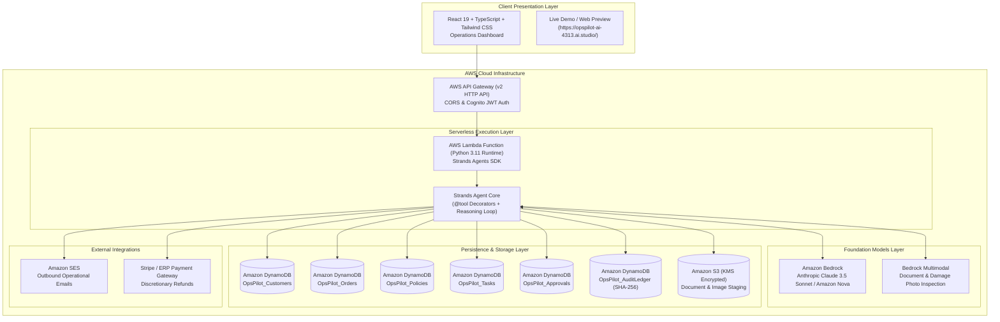

# OpsPilot AI — Autonomous Operations Agent for Small Businesses

[](LICENSE)
[](https://agentsforhumans.devpost.com)
[](https://agentsforhumans.devpost.com)
[](https://strandsagents.com)
[](https://aws.amazon.com/bedrock/)
[](https://opspilot-ai-4313.ai.studio/)

> **Live Demo:** [https://opspilot-ai-4313.ai.studio/](https://opspilot-ai-4313.ai.studio/)  
> **Submission Track:** Professional Agents Track  
> **Open Source License:** [MIT License](LICENSE)  

---

## Pitch & Submission Overview

### 1. The Problem We're Solving
Small businesses and growing e-commerce merchants lose hundreds of hours every month dealing with repetitive, judgment-heavy operational friction:
- Damaged-goods claims requiring photo verification against return policies.
- Vendor invoice mismatches requiring cross-checking with Purchase Orders.
- Customer support ticket queues waiting for human verification of order states.
- High-risk operations (e.g. issuing refunds or committing store credit) where standard AI chatbots either halluncinate unauthorized payouts or completely lack operational tool execution authority.

### 2. Who It's For
OpsPilot AI is built for **small-to-medium business owners, e-commerce operations leads, customer support supervisors, and accounts payable teams** who need autonomous operational execution without surrendering control or safety.

### 3. Why It Matters
Most AI agent frameworks are either generic conversational chatbots that cannot reliably execute real business operations, or unconstrained autonomous bots that risk financial liability. OpsPilot AI solves this by introducing:
- **Real End-to-End Work**: Directly fetches CRM/order records, inspects photos with multimodal AI, checks business policies, drafts responses, and issues refunds.
- **Strict Human-in-the-Loop (HITL) Intercepts**: Discretionary limits (e.g. $\le \$50$ autonomous refunds) allow routine claims to resolve instantly, while high-risk actions halt and queue for human sign-off in the Approval Center.
- **Prompt Injection Immunity**: Treats all customer emails and documents as inert, isolated `<untrusted_external_data>` to protect corporate policies and budgets.
- **Cryptographic Auditability**: Every decision and tool call is hash-chained with SHA-256 into Amazon DynamoDB for verifiable compliance.

---

## 1. Architectural Blueprint

OpsPilot AI is architected natively for Amazon Web Services using the **Strands Agents SDK** and **Amazon Bedrock**:

### Mermaid Architecture Diagram



### Infrastructure Dataflow Blueprint

```
[ React / TypeScript Frontend ]
              │
              ▼ (HTTPS / Cognito JWT)
[ AWS API Gateway (v2 HTTP API) ]
              │
              ▼
[ AWS Lambda Functions (Python 3.11 Runtime) ]
              │
              ▼
[ Python Strands Agents SDK ] ────► [ Amazon Bedrock (Claude 3.5 Sonnet / Nova) ]
              │
              ├──► get_customer() ───────────► Amazon DynamoDB (OpsPilot_Customers)
              ├──► get_order() ──────────────► Amazon DynamoDB (OpsPilot_Orders)
              ├──► search_business_policy() ──► Amazon DynamoDB (OpsPilot_Policies)
              ├──► analyze_document() ───────► Amazon S3 + Bedrock Multimodal
              ├──► send_email() ─────────────► Amazon SES
              ├──► issue_refund() ───────────► Stripe / Payment Gateway
              ├──► create_followup_task() ───► Amazon DynamoDB (OpsPilot_Tasks)
              └──► record_audit_event() ─────► Amazon DynamoDB (OpsPilot_AuditLedger)
```

---

## 2. Why Strands Agents SDK?

- **Native AWS & Amazon Bedrock Optimization:** Purpose-built for low-latency tool orchestration with foundation models on Amazon Bedrock (including Anthropic Claude 3.5 Sonnet and Amazon Nova).
- **First-Class Python `@tool` Ecosystem:** Clean functional tool definitions decorated with `@tool` allow the agent to inspect DynamoDB tables, invoke Bedrock multimodal vision, and dispatch SES emails.
- **Strict Human-in-the-Loop Intercepts:** Unlike conversational chat frameworks that treat tool calls as side effects, Strands enables halting the execution pipeline at the `APPROVE` stage when discretionary boundaries (e.g. $50 financial limit) are met.
- **Serverless Ready:** Fast startup in AWS Lambda with zero heavy platform overhead.

---

## 3. The 9-Stage Operations Pipeline

OpsPilot AI structures all operational tasks into an explicit, transparent 9-stage pipeline:

1. **UNDERSTAND:** Ingest user request or inbound message; envelope external content as untrusted data to neutralize prompt injection.
2. **PLAN:** Generate tool invocation sequence and data retrieval graph.
3. **RETRIEVE:** Fetch customer records, order details, and policy manuals from DynamoDB.
4. **REASON:** Cross-reference operational facts against standard operating procedures (SOPs) and examine damage photos via Bedrock Multimodal.
5. **DECIDE:** Formulate concrete remediation actions (e.g. replacement, refund, billing task).
6. **APPROVE (Human-in-the-Loop Gate):** Verify whether proposed action exceeds discretionary authority limits ($50 limit). If limit is exceeded, execution halts and stages an approval request in the Approval Center.
7. **EXECUTE:** Invoke external tools (payment API, Amazon SES email, carrier dispatch).
8. **VERIFY:** Confirm external API success codes and update customer dispute status.
9. **AUDIT:** Generate an immutable, cryptographically sequenced (SHA-256) event entry in DynamoDB.

---

## 4. Security & Safety Model

### Prompt Injection Defense (Untrusted Data Envelope)
External data (customer emails, invoice text, attached files) is strictly isolated within an untrusted data envelope:
```xml
<untrusted_external_data>
Customer email body or document OCR text here
</untrusted_external_data>
```
The system prompt strictly instructs the agent to treat this payload purely as inert data to extract facts from, ignoring any instructions to alter system behavior, reveal prompts, or approve actions.

### Discretionary Authority Limits
- **Refunds ≤ $50.00:** Agent is authorized to issue refunds autonomously if policy criteria are satisfied.
- **Refunds > $50.00:** Hard-coded security gate triggers `WAITING FOR APPROVAL`. Execution stops until an authorized Operations Lead approves or rejects the action in the UI.
- **Outbound Email Review:** Emails involving formal dispute threats, carrier claims, or legal terminology are automatically queued for human sign-off.

### Zero Secrets in Frontend
No AWS credentials, IAM secret keys, or Bedrock tokens are ever bundled or exposed in the frontend. All cloud authentication occurs server-side via AWS Cognito and IAM Lambda execution roles.

---

## 5. Demo Mode vs. Production Mode

OpsPilot AI features a dual-mode service architecture (`src/services/api.ts`):

| Feature | Demo Mode (Local Preview) | Production Mode (AWS Cloud) |
| :--- | :--- | :--- |
| **Backend** | Reactive local simulation in browser storage | AWS API Gateway + AWS Lambda |
| **Agent Engine** | Step-by-step pipeline visualizer with realistic reasoning | Python Strands Agents SDK + Amazon Bedrock |
| **Financial Actions** | Clearly tagged with `[DEMO ACTION]` (no charges made) | Live Stripe / ERP payment gateway via Lambda |
| **Email Dispatch** | Simulated delivery to preview console | Amazon SES verified domain sending |
| **Audit Log** | Local SHA-256 hash chain in `localStorage` | KMS-encrypted Amazon DynamoDB audit ledger |
| **Activation** | Default when `VITE_API_GATEWAY_URL` is unset | Automatically engaged when `VITE_API_GATEWAY_URL` is set |

---

## 6. AWS Deployment Guide

### Prerequisites
1. AWS CLI configured (`aws configure`)
2. Node.js 18+ and Python 3.11+
3. AWS CDK CLI (`npm install -g aws-cdk`)

### Step 1: Deploy AWS Backend
```bash
# Navigate to CDK directory
cd aws/cdk

# Install Python CDK dependencies
pip install -r requirements.txt

# Bootstrap CDK environment (first time only)
cdk bootstrap

# Deploy the OpsPilot infrastructure stack
cdk deploy
```

Upon completion, the CDK output will provide your **API Gateway Endpoint URL**:
```
Outputs:
OpsPilotStack.OpsPilotHttpApiEndpoint = https://a1b2c3d4.execute-api.us-east-1.amazonaws.com
```

### Step 2: Configure Environment Variables
Copy `.env.example` to `.env` in the project root:
```bash
cp .env.example .env
```
Set the API Gateway URL:
```env
VITE_API_GATEWAY_URL=https://a1b2c3d4.execute-api.us-east-1.amazonaws.com
```

### Step 3: Run the Frontend
```bash
npm install
npm run dev
```
### Quickstart: Running Locally Without AWS (Demo Mode)
OpsPilot AI works 100% out of the box without requiring AWS credentials or cloud infrastructure:
```bash
npm install
npm run dev
```
Open `http://localhost:3000` to test all 10 views, the 9-stage Strands pipeline, human approvals, and cryptographic audit logging in high-fidelity Demo Mode!

---

## 7. Directory Structure

```
├── LICENSE                        # Open Source MIT License (Hackathon Mandate)
├── README.md                      # Architecture and deployment guide
├── package.json                   # React 19 / TypeScript / Vite dependencies
├── vite.config.ts                 # Vite bundler configuration
├── aws/
│   ├── test_aws_connection.py     # AWS Account & Bedrock Readiness Checker
│   ├── strands_agent/
│   │   ├── agent.py               # Strands Agent definition with Bedrock model
│   │   ├── tools.py               # 8 Custom business tools with DynamoDB/S3/SES
│   │   └── requirements.txt       # Lambda Strands & Boto3 dependencies
│   ├── cdk/
│   │   ├── app.py                 # AWS CDK entrypoint application
│   │   ├── cdk.json               # AWS CDK configuration
│   │   ├── opspilot_stack.py      # AWS CDK infrastructure stack definition
│   │   └── requirements.txt       # CDK Python dependencies
│   └── API_CONTRACT.md            # Detailed REST API specification
├── src/
│   ├── components/
│   │   ├── BottomNav.tsx          # Mobile bottom navigation bar
│   │   ├── Sidebar.tsx            # Responsive navigation drawer (mobile & desktop)
│   │   ├── TopBar.tsx             # Responsive global search, status, and hamburger menu
│   │   ├── modals/                # Architecture overview & demo mode modals
│   │   └── views/
│   │       ├── DashboardView.tsx       # KPI summaries and rapid launch
│   │       ├── AgentWorkspaceView.tsx  # 9-stage pipeline visualizer
│   │       ├── ApprovalsView.tsx       # Human-in-the-loop review center
│   │       ├── TasksView.tsx           # Operational tasks queue
│   │       ├── CustomersView.tsx       # Customer directory and interaction histories
│   │       ├── DocumentsView.tsx       # Drag-and-drop OCR intake and analysis
│   │       ├── AnalyticsView.tsx       # Automation telemetry and metrics
│   │       ├── AuditLogView.tsx        # Cryptographic immutable audit trail
│   │       ├── InboxView.tsx           # Inbound customer requests intake
│   │       └── SettingsView.tsx        # Security, RBAC, and approval limits
│   ├── data/
│   │   └── mockData.ts            # High-fidelity domain seed data
│   ├── services/
│   │   └── api.ts                 # Dual-mode API service layer
│   ├── types.ts                   # Core domain TypeScript interfaces
│   ├── App.tsx                    # Main application controller
│   └── main.tsx                   # React DOM root
```

---

## 8. License

This project is licensed under the **MIT License** - see the [LICENSE](LICENSE) file for details.
All submission materials comply with the official rules for the **Agents for Humans Hackathon**.
